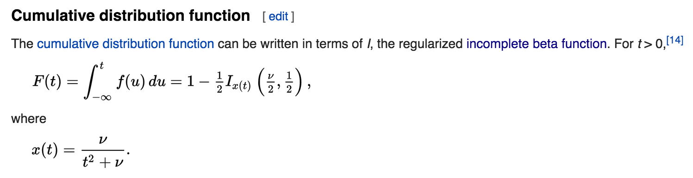

# Overview

This package exposes pure Go implementations of

1. The beta function
2. The regularized/normalized incomplete beta function

These function are particularly useful in computing p-values for [Student's t-distribution](https://en.wikipedia.org/wiki/Student%27s_t-distribution):



It follows that the CDF could be implemented like this:

```
// studentsCDF is the CDF for Student's t-distribution.
// The value returned can also be considered the corresponding
// p-value for a one-sided t-test.
func studentsCDF(t float64, df uint) {
     x := float64(df) / (t * t + float64(df))
     return 1.0 - 0.5 * beta.BetaInc(0.5 * float64(df), 0.5, x)
}
```

Note that the value returned can also be considered the corresponding p-value for a one-sided t-test.

### Installation

`go get github.com/gragas/beta`

### Things of Note

It should be noted that this implementation of `BetaInc` has undefined behavior for a < 0 || b < 0.


### Implementation

This implementation is a near direct port of the related functions found in GSL's `gsl_sf_gamma.h`. The related functions are:

1. `gl_sf_beta_inc`
2. `beta_cont_frac`

## Contributing

Forks, issues, and PRs are all welcome.

GNU Public License V3.